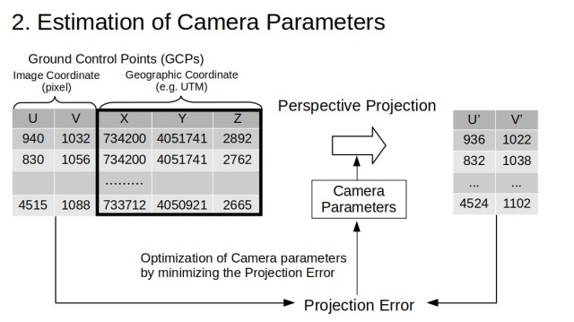
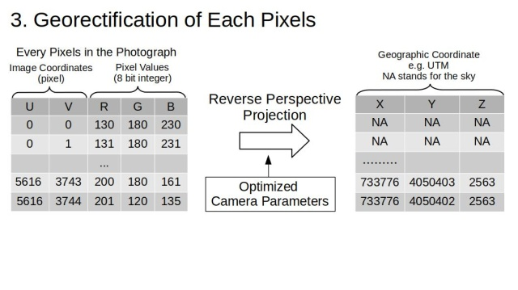
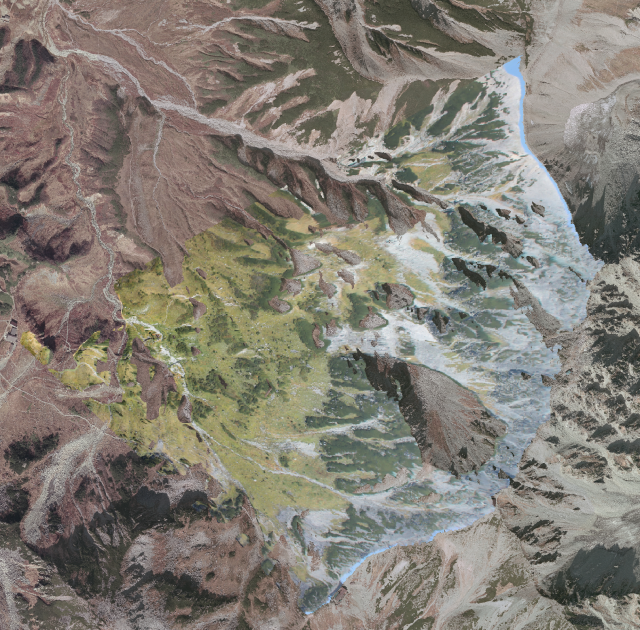

# alproj
A simple georectification tool for alpine landscape photographs.

[Documentation](https://alproj.readthedocs.io/en/latest/index.html)
[日本語ドキュメント](https://alproj.readthedocs.io/ja/latest/index.html)
[paper](https://doi.org/10.1002/rse2.364)

## GUI Version

For an interactive experience without writing code, check out [alproj-gui](https://github.com/0kam/alproj-gui) — a desktop GUI application for georectification powered by alproj, built with Tauri.

## Overview
`alproj` is a simple python package for geo-rectification of alpine landscape photographs.   
`alproj` has 3 steps for geo-rectification of landscape photograph.  

1. Setting Ground Control Points (GCPs) in target photographs, using simulated landscape images rendered with Digital Surface Models and airborne photographs.


2. Heuristic estimation of camera parameters including the camera angle, field of view, and lens distortions (shooting point of the photograph is required).


3. Perspective reverse projection of the target photograph on Digital Surface Model, with estimated camera parameters, using OpenGL.




This project aims to revive alpine landscape photographs in your photo albams, as valuable geospatial data that may reveal the unknown changes of alpine landscape, ecosystem and cryosphere!

## Installation

**Requires Python 3.9-3.12**

```bash
pip install "alproj[vismatch]"
```

This installs alproj with [vismatch](https://github.com/gmberton/vismatch) for deep learning-based matching (70+ methods including RoMa, LoFTR, LightGlue, MatchAnything, etc.).

For a minimal installation without deep learning dependencies (only AKAZE/SIFT matching):

```bash
pip install alproj
```

## Quick Start
See [example.py](example.py) for usage.

## Acknowledgements
The example photograph is of [NIES' long-period monitoring](https://db.cger.nies.go.jp/gem/ja/mountain/station.html?id=2).   

## Citation
Okamoto, R., Ide, R. and Oguma, H. (2023), Automatically drawing vegetation classification maps using digital time-lapse cameras in alpine ecosystems. Remote Sens Ecol Conserv. https://doi.org/10.1002/rse2.364

```
@article{https://doi.org/10.1002/rse2.364,
author = {Okamoto, Ryotaro and Ide, Reiko and Oguma, Hiroyuki},
title = {Automatically drawing vegetation classification maps using digital time-lapse cameras in alpine ecosystems},
journal = {Remote Sensing in Ecology and Conservation},
volume = {n/a},
number = {n/a},
pages = {},
keywords = {Alpine ecosystem, deep learning, ecosystem monitoring, ground-based imagery, time-lapse camera, vegetation mapping},
doi = {https://doi.org/10.1002/rse2.364},
url = {https://zslpublications.onlinelibrary.wiley.com/doi/abs/10.1002/rse2.364},
eprint = {https://zslpublications.onlinelibrary.wiley.com/doi/pdf/10.1002/rse2.364},
abstract = {Abstract Alpine ecosystems are particularly vulnerable to climate change. Monitoring the distribution of alpine vegetation is required to plan practical conservation activities. However, conventional field observations, airborne and satellite remote sensing are difficult in terms of coverage, cost and resolution in alpine areas. Ground-based time-lapse cameras have been used to observe the regions' snowmelt and vegetation phenology and offer significant advantages in terms of cost, resolution and frequency. However, they have not been used in research monitoring of vegetation distribution patterns. This study proposes a novel method for drawing georeferenced vegetation classification maps from ground-based imagery of alpine regions. Our approach had two components: vegetation classification and georectification. The proposed vegetation classification method uses a pixel time series acquired from fall images, utilizing the fall leaf color patterns. We demonstrated that the performance of the vegetation classification could be improved using time-lapse imagery and a Recurrent Neural Network. We also developed a novel method to accurately transform ground-based images into georeferenced data. We propose the following approaches: (1) an automated procedure to acquire Ground Control Points and (2) a camera model that considers lens distortions for accurate georectification. We demonstrated that the proposed approach outperforms conventional methods, in addition to achieving sufficient accuracy to observe the vegetation distribution on a plant-community scale. The evaluation revealed an F1 score and root-mean-square error of 0.937 and 3.4 m in the vegetation classification and georectification, respectively. Our results highlight the potential of inexpensive time-lapse cameras to monitor the distribution of alpine vegetation. The proposed method can significantly contribute to the effective conservation planning of alpine ecosystems.}
}
```
