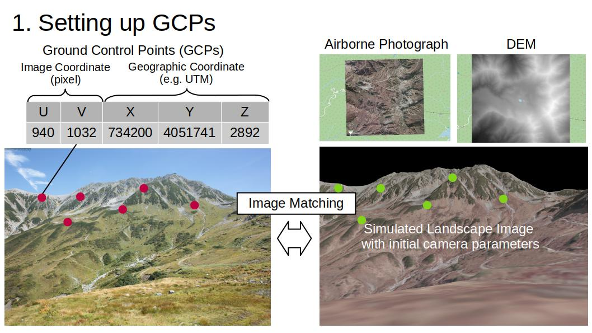

# alproj
A simple georectification tool for alpine landscape photographs.

[Documentation](https://alproj.readthedocs.io/en/latest/index.html)
## Overview
`alproj` is a simple python package for geo-rectification of alpine landscape photographs. 
`alproj` has 4 steps.
1. Setting Ground Control Points (GCPs) in target photographs, using simulated landscape images rendered with Digital Surface Models and airborne photographs.

2. Heuristic estimation of camera parameters including the camera angle, field of view, and lens distortions (shooting point of the photograph is required).

3. Perspective reverse projection of the target photograph on Digital Surface Model, with estimated camera parameters, using OpenGL.

This project aims to revive alpine landscape photographs in your photo albams, as valuable geospatial data that may reveal the unknown changes of alpine landscape, ecosystem and cryosphere!

## Installation
`pip install git+https://github.com/0kam/alproj`

## Acknowledgements
The example photograph is of [NIES' long-period monitoring](https://db.cger.nies.go.jp/gem/ja/mountain/station.html?id=2).   