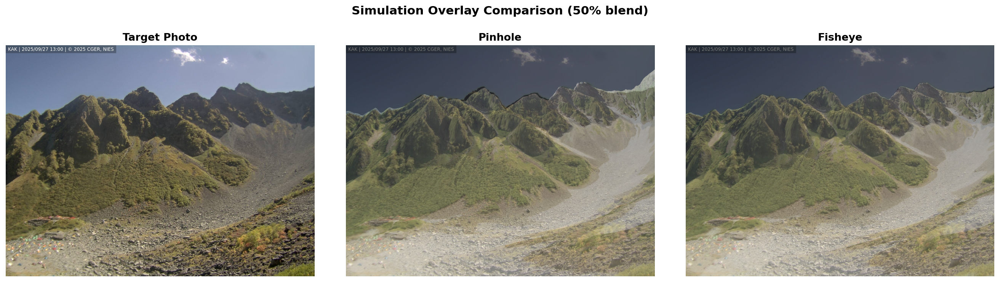
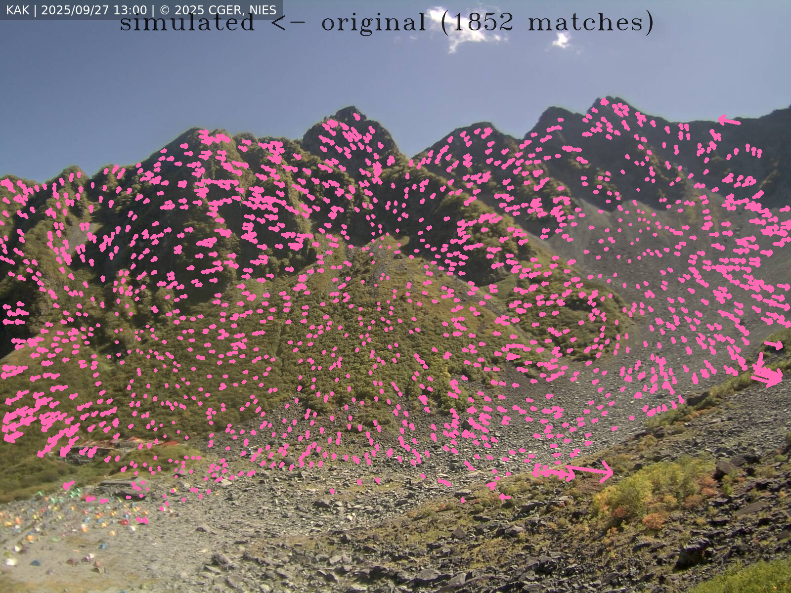
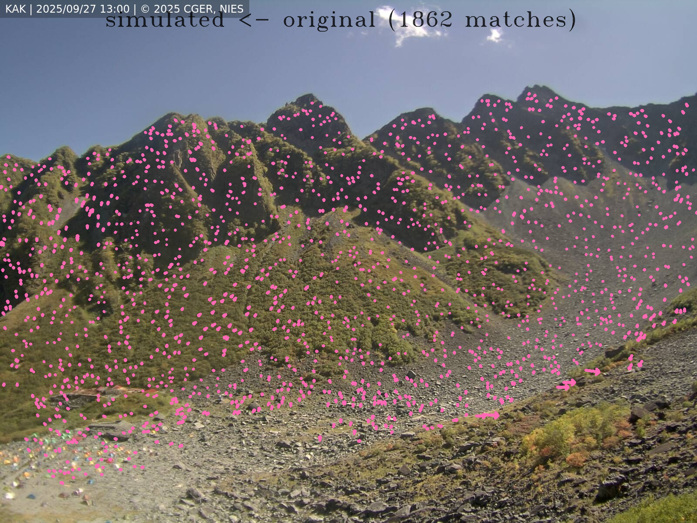
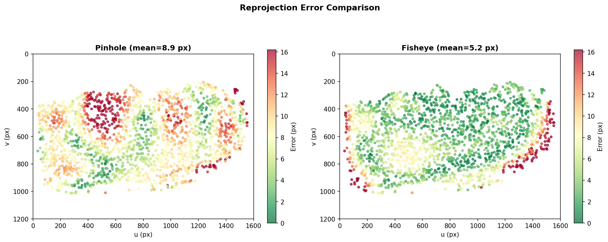

# Camera Model Comparison

`alproj` supports two camera projection models: **Pinhole** and **Fisheye**. This page compares their performance on a wide-angle monitoring camera image. Choosing the right model for your camera is key to accurate georectification.

The example images on this page are from [NIES alpine monitoring at Mt. Maehotaka](https://db.cger.nies.go.jp/gem/ja/mountain/station.html?id=33).

## When to Use Which Model

| | Pinhole | Fisheye |
|---|---------|---------|
| **Projection** | Rectilinear | Equidistant |
| **Best for** | Standard lenses (FOV < ~90°) | Wide-angle / monitoring cameras (FOV ~75–120°) |
| **Distortion params** | 14 (k1–k6, p1, p2, s1–s4, a1, a2) | 8 (k1–k4, a1, a2, p1, p2) |
| **Distortion space** | Image space (pixels) | Angle space (radians) |
| **Usage** | Default (no `model` key needed) | Set `"model": "fisheye"` in params |

**Rule of thumb:** The pinhole model handles barrel distortion well for most lenses, including typical wide-angle lenses. For cameras with particularly strong distortion (e.g., surveillance cameras, action cameras, webcams), the fisheye model provides better accuracy.

## Simulation Overlay

The image below shows a 50% blend of each model's simulated image over the target photograph. A better-fitting model produces a sharper overlay with less ghosting.



Since this scene was captured with a surveillance camera that has particularly strong barrel distortion, the fisheye model produces a tighter fit, especially near the image edges. For most lenses, including typical wide-angle lenses, the pinhole model performs well thanks to its own barrel distortion correction.

## Matching Results

Feature matching (RoMa) between the target photograph and each model's simulation:

**Pinhole (1852 matches):**



**Fisheye (1862 matches):**



Both models yield a similar number of matches, but the fisheye model's matches are more spatially uniform because the simulation better represents the actual geometry of this wide-angle camera.

## Reprojection Error

Reprojection error measures how accurately the optimized camera parameters project 3D ground control points back onto the image plane. Lower is better.

| Model | Mean (px) | Median (px) | P90 (px) |
|-------|-----------|-------------|----------|
| Pinhole | 8.93 | 8.77 | 14.27 |
| Fisheye | 5.24 | 3.86 | 10.18 |

For this wide-angle camera, the fisheye model reduces mean reprojection error by **41%** compared to the pinhole model.



The spatial error distribution shows that the pinhole model struggles with the extreme barrel distortion of this surveillance camera near the image edges, while the fisheye model maintains low errors across the entire image. Note that for most lenses, the pinhole model's own distortion correction is sufficient — the fisheye model's advantage is specific to cameras with particularly strong distortion like the one used here.

## Quick Start: Fisheye Model

To use the fisheye model, add `"model": "fisheye"` to your camera parameters:

```python
params = {
    "model": "fisheye",
    "x": -75398.449, "y": 33109.773, "z": 2366.0,
    "fov": 75.0, "pan": 155.0, "tilt": 5.0, "roll": 0.0,
    "w": 1600, "h": 1200, "cx": 800, "cy": 600,
    "k1": 0.0, "k2": 0.0, "k3": 0.0, "k4": 0.0,
    "a1": 1.0, "a2": 1.0, "p1": 0.0, "p2": 0.0,
}
```

The rest of the pipeline (`sim_image`, `image_match`, `CMAOptimizer`, `reverse_proj`, `to_geotiff`) works exactly the same. The optimizer automatically dispatches to the correct projection function based on the `model` key.

