# Matching Methods Gallery

This page shows the matching results for all available methods. All images were generated using the same input pair (5616x3744 pixel photograph and simulated image) on CPU (M4 Pro MBP).

Any method supported by [vismatch](https://github.com/gmberton/vismatch) (70+ models) can be used. See [Usage](usage.md) for details.

## Built-in Methods (No Extra Dependencies)

### AKAZE
- **Time:** ~1 sec | **Matches:** 176

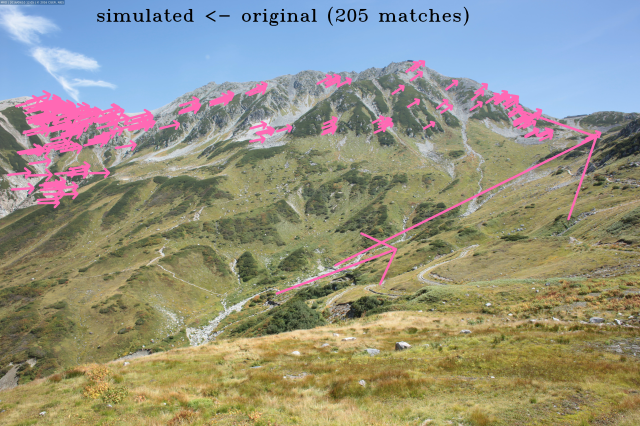

### SIFT
- **Time:** ~4 sec | **Matches:** 331

## LightGlue-based Methods (Lightweight)

These methods can handle full-resolution images efficiently.

### SIFT-LightGlue
- **Time:** ~3 sec | **Matches:** 518

### SuperPoint-LightGlue
- **Time:** ~4 sec | **Matches:** 962

### ALIKED-LightGlue
- **Time:** ~6 sec | **Matches:** 815

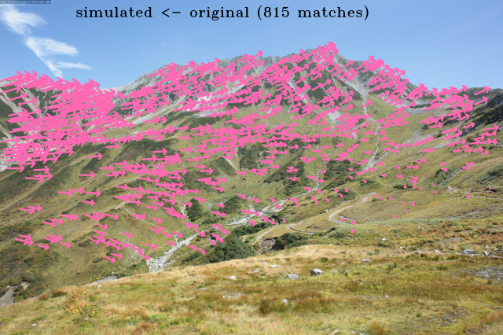

### MiniMa-SuperPoint-LightGlue
- **Time:** ~29 sec | **Matches:** 973

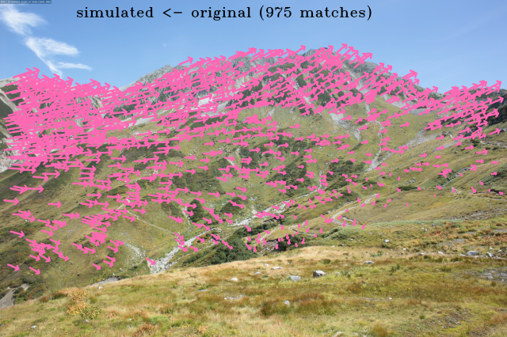

## Dense Matching Methods (High Match Count)

These methods automatically resize images to 640px when `resize` is not specified to prevent out-of-memory errors.

### Tiny-RoMa
- **Time:** ~2 sec | **Matches:** 2047

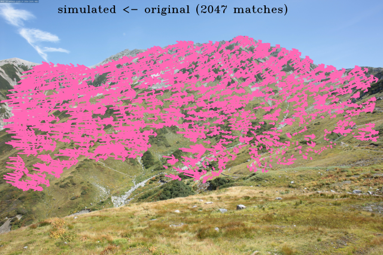

### LoFTR
- **Time:** ~2 sec | **Matches:** 2198

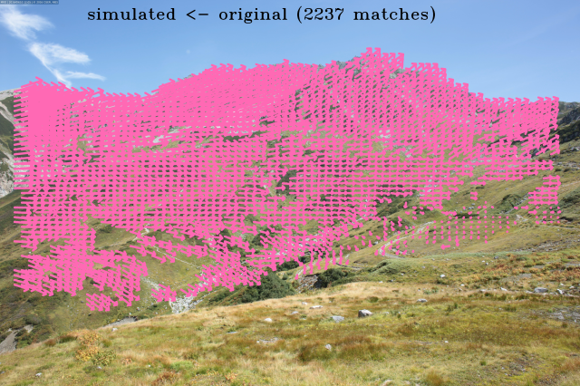

### MiniMa-LoFTR
- **Time:** ~3 sec | **Matches:** 2629

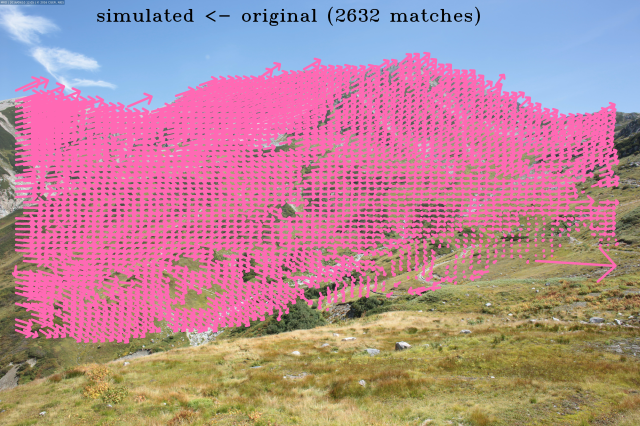

### UFM
- **Time:** ~10 sec | **Matches:** 2048

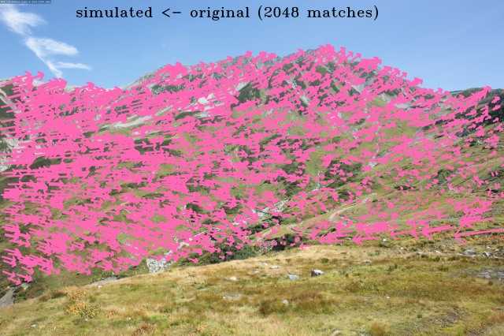

### RDD
- **Time:** ~14 sec | **Matches:** 1494

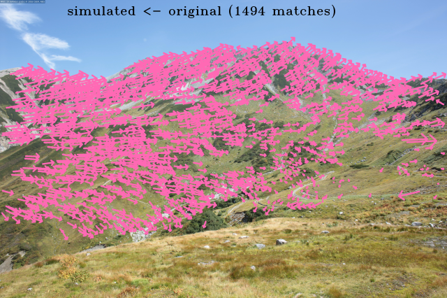

### RoMa
- **Time:** ~23 sec | **Matches:** 2048

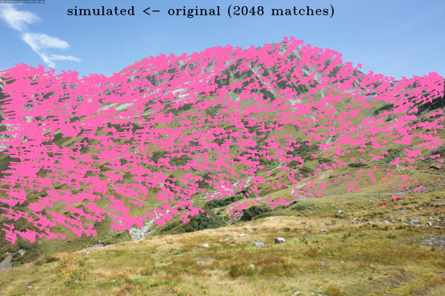

### MAST3R
- **Time:** ~327 sec | **Matches:** 3515

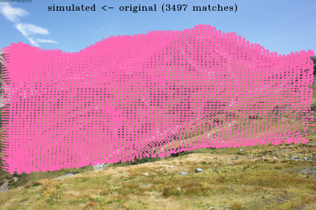

### MiniMa-RoMa
- **Requires CUDA** (large model). Use `minima-roma-tiny` for CPU.

## Cross-Modal Methods (Robust to Appearance Changes)

These methods are designed for matching across different modalities, seasons, and resolutions.

### MatchAnything-ELoFTR
- **Time:** ~2 sec | **Matches:** 2547

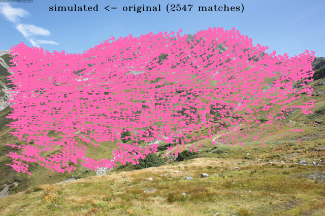

### MatchAnything-RoMa
- **Time:** ~23 sec | **Matches:** 4999

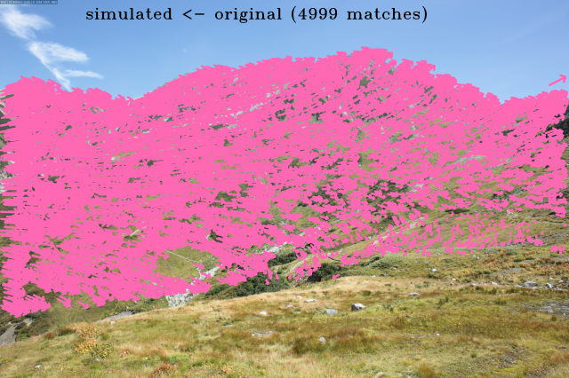

### GIM-DKM
- **Time:** ~34 sec | **Matches:** 2048

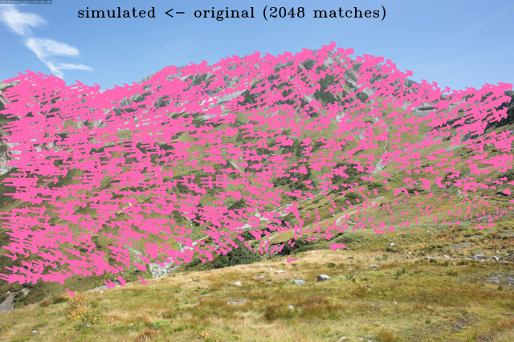
