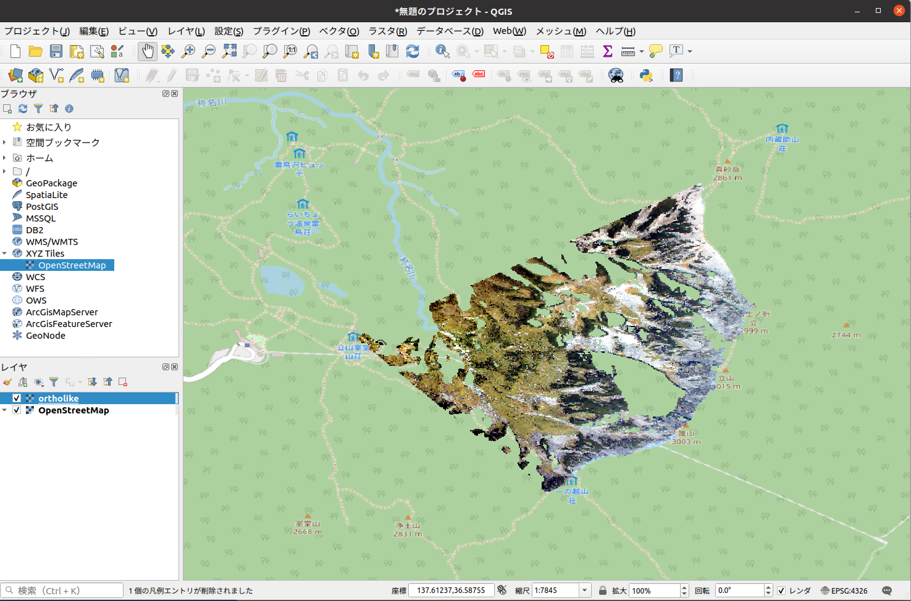

# Overview
## Algorithm
`alproj` is a simple python package for geo-rectification of alpine landscape photographs.   
`alproj` has 3 steps for geo-rectification of a lanscape photograph.

1. Setting Ground Control Points (GCPs) in a target photograph, using a simulated landscape image rendered with Digital Surface Model and airborne photographs.

2. Heuristic estimation of camera parameters including the camera angle, field of view, and lens distortions (shooting point of the photograph is required).

3. Reverse perspective projection of the target photograph on Digital Surface Model, with estimated camera parameters, using OpenGL.


Now, every pixels in the photograph has its geographic coordinates!


You can visualize the results with GIS tools. Here, I show an example using R's [sf](https://r-spatial.github.io/sf/) and [stars](https://r-spatial.github.io/stars/) package.
```{r}
library(sf)
library(stars)
library(tidyverse)

# Read result csv file
points <- read_csv(
  "georectificated.csv",
  col_types = cols_only(x = "d", y = "d", R = "d", G = "d", B = "d")
) %>%
  mutate(R = as.integer(R), G = as.integer(G), B = as.integer(B))

# Converting the dataframe to points. 
points <- points %>% 
  st_as_sf(coords = c("x", "y"))

# Rsaterize
R <- points %>%
  select(R) %>%
  st_rasterize(dx = 5, dy = 5) 

G <- points %>%
  select(G) %>%
  st_rasterize(dx = 5, dy = 5) 

B <- points %>%
  select(B) %>%
  st_rasterize(dx = 5, dy = 5) 

rm(points)

gc()

raster <- c(R, G, B) %>%
  merge() %>%
  `st_crs<-`(6690)

# Plotting

ggplot() +
  geom_stars(data = st_rgb(raster)) +
  scale_fill_identity()

# Saving raster data as a GeoTiff file.
write_stars(raster, "ortholike.tif")
```

Result Plot


You can open the created geotiff file with GIS softwares such as QGIS and ArcGIS.



## Future applications in alpine ecology, geology and glaciology
- Drawing vegetation maps from landscape photographs taken by hikers.
- Analysing snow melting with webcams attached at mountain huts.
- Estimating the area of glaciers in the past from historical photographs of glaciers.