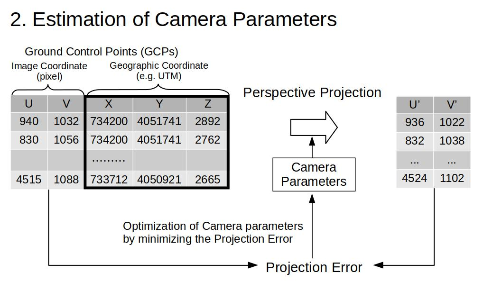
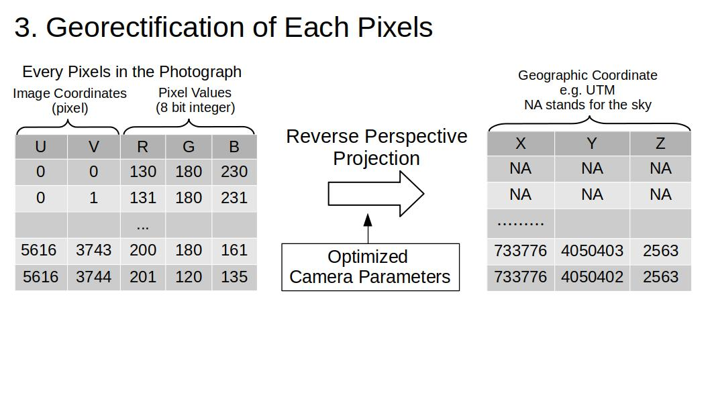
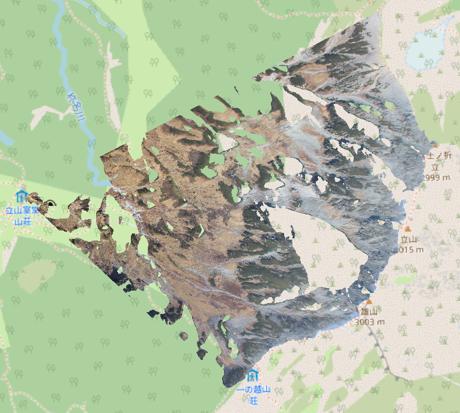

<script type="text/javascript" async src="https://cdnjs.cloudflare.com/ajax/libs/mathjax/2.7.7/MathJax.js?config=TeX-MML-AM_CHTML">
</script>
<script type="text/x-mathjax-config">
 MathJax.Hub.Config({
 tex2jax: {
 inlineMath: [['$', '$'] ],
 displayMath: [ ['$$','$$'], ["\\[","\\]"] ]
 }
 });
</script>

# Overview
## Algorithm
`alproj` is a simple python package for geo-rectification of alpine landscape photographs.   
`alproj` has 3 steps for geo-rectification of a landscape photograph.

1. Setting Ground Control Points (GCPs) in a target photograph, using a simulated landscape image rendered with Digital Surface Model and airborne photographs.

2. Heuristic estimation of camera parameters including the camera angle, field of view, and lens distortions (shooting point of the photograph is required).

3. Reverse perspective projection of the target photograph on Digital Surface Model, with estimated camera parameters, using OpenGL.


Now, every pixel in the photograph has its geographic coordinates!


You can export the results as a GeoTIFF using the built-in `to_geotiff` function:

```python
from alproj.project import to_geotiff

to_geotiff(
    georectified,          # Result of reverse_proj()
    "ortholike.tif",
    resolution=1.0,        # Pixel resolution in meters
    crs="EPSG:6690",       # Coordinate Reference System
    bands=["R", "G", "B"], # Bands to export
    interpolate=True       # Fill small gaps
)
```

You can open the created GeoTIFF file with GIS software such as QGIS and ArcGIS.



## The Camera Model
`alproj` uses a camera model that is  almost same as the [OpenCV's one](https://docs.opencv.org/3.4/d9/d0c/group__calib3d.html), however, the distortion coefficients are a little bit modified.
- OpenCV
$$ \begin{bmatrix} x'' \\\\ y'' \end{bmatrix} = \begin{bmatrix} x' \frac{1 + k_1 r^2 + k_2 r^4 + k_3 r^6}{1 + k_4 r^2 + k_5 r^4 + k_6 r^6} + 2 p_1 x' y' + p_2(r^2 + 2 x'^2) + s_1 r^2 + s_2 r^4 \\\\ y' \frac{1 + k_1 r^2 + k_2 r^4 + k_3 r^6}{1 + k_4 r^2 + k_5 r^4 + k_6 r^6} + p_1 (r^2 + 2 y'^2) + 2 p_2 x' y' + s_3 r^2 + s_4 r^4 \\ \end{bmatrix} $$
- alproj
$$ \begin{bmatrix} x'' \\\\ y'' \end{bmatrix} = \begin{bmatrix} x' \frac{1 + k_1 r^2 + k_2 r^4 + k_3 r^6}{1 + k_4 r^2 + k_5 r^4 + k_6 r^6} + 2 p_1 x' y' + p_2(r^2 + 2 x'^2) + s_1 r^2 + s_2 r^4 \\\\ y' \frac{1 + a_1 + k_1 r^2 + k_2 r^4 + k_3 r^6}{1 + a_2 + k_4 r^2 + k_5 r^4 + k_6 r^6} + p_1 (r^2 + 2 y'^2) + 2 p_2 x' y' + s_3 r^2 + s_4 r^4 \\ \end{bmatrix} $$

I added `a1` and `a2` to express inequal aspect ratios of image pixels.

## Future applications in alpine ecology, geology, and glaciology
- Drawing vegetation maps from landscape photographs taken by hikers.
- Analysing snow melting with webcams attached at mountain huts.
- Estimating the area of glaciers in the past from historical photographs of glaciers.