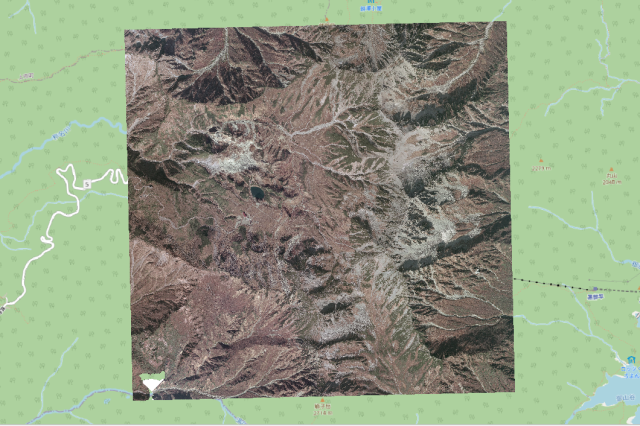
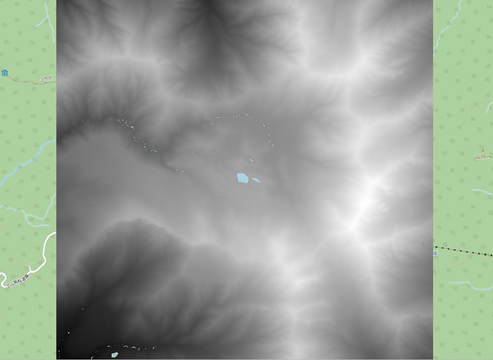
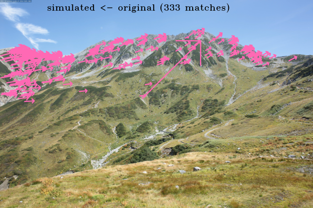
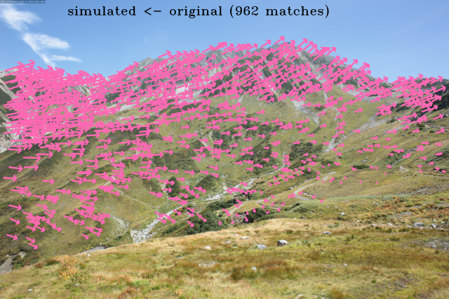
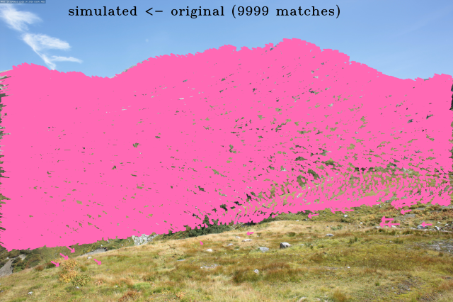
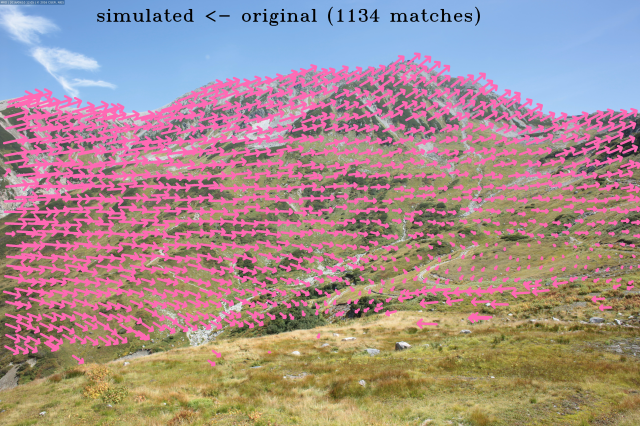

# Usage
Here I show an example of the geo-rectification process using a photograph of [NIES' long-term monitoring](https://db.cger.nies.go.jp/gem/ja/mountain/station.html?id=2) taken at Tateyama Murodo-Sanso, Toyama prefecture, Japan.

```python
# Loading requirements
from alproj.surface import get_colored_surface
from alproj.project import sim_image, reverse_proj, to_geotiff
from alproj.gcp import image_match, set_gcp, filter_gcp_distance
from alproj.optimize import CMAOptimizer, LsqOptimizer
import rasterio
import cv2
```
## Data Preparation
You should prepare below before starting.
- The target landscape photograph.

- An orthorectificated airborne photograph.

- A Digital Surface Model.


Both the airborne photograph and the DSM must cover hole the area where the target photograph covers. 
Both of them must be in the same planar Coordinate Reference System, e.g. Universal Transverse Mercator Coordinate System (UTM).

## Loading Raster Data
First, load the airborne photograph and the DSM using rasterio.
```python
res = 1.0 # Resolution in m
aerial = rasterio.open("airborne.tif")
dsm = rasterio.open("dsm.tif")
```

## Define Initial Camera Parameters
Setting initial camera parameters for optimization.
- x, y, z: A shooting point coordinate in the CRS of the aerial photograph / DSM. These can also be optimized to correct GPS errors.
- fov: A Field of View in degree.
- pan, tilt, roll: A set of Euler angles of the camera in degree.
- a1 ~ s4: Distortion coefficients. See [Algorithm](https://alproj.readthedocs.io/en/latest/overview.html#algorithm) for detail.
- w, h: The width and height of the target image in pixel.
- cx, cy: A coordinate of the principal point in pixel.
 
```python
params = {"x":732731,"y":4051171, "z":2458, "fov":70, "pan":100, "tilt":0, "roll":0,\
          "a1":1, "a2":1, "k1":0, "k2":0, "k3":0, "k4":0, "k5":0, "k6":0, \
          "p1":0, "p2":0, "s1":0, "s2":0, "s3":0, "s4":0, \
          "w":5616, "h":3744, "cx":5616/2, "cy":3744/2}
```

## Rendering a Simulated Landscape Image
To find a set of Ground Control Points, render a simulated landscape image with the aerial photograph, DSM, and the initial camera parameters.

First, get colored surface from aerial photograph and DSM.
```python
distance = 3000 # Distance from shooting point in meters

vert, col, ind, offsets = get_colored_surface(aerial, dsm, shooting_point=params, distance=distance, res=res) # This takes some minutes.
```
Then you'll get four `np.array`s looks like below.
- vert

  Vertex coordinates of each point relative to offsets. In x, z, y order.
  ```
  >>> vert
  array([[3.00000000e+03, 3.84212890e+02, 4.65500000e+03],
       [3.00100000e+03, 3.82377200e+02, 4.65500000e+03],
       [2.99900000e+03, 3.84474370e+02, 4.65400000e+03],
       ...,
       [2.23200000e+03, 9.98540000e-01, 0.00000000e+00],
       [2.23300000e+03, 5.04880000e-01, 0.00000000e+00],
       [2.23400000e+03, 0.00000000e+00, 0.00000000e+00]])
  ```
- col  
  
  Vertex colors in 0 to 1.
  ```
  >>> col
  array([[0.37647059, 0.35686275, 0.32156863],
       [0.36078431, 0.33333333, 0.30980392],
       [0.42352941, 0.40392157, 0.36078431],
       ...,
       [0.        , 0.        , 0.        ],
       [0.        , 0.        , 0.        ],
       [0.        , 0.        , 0.        ]])
  ```
- ind
  
  The index shows which three points form a triangle.
  ```
  >>> ind
  array([[      0,       3,       4],
       [      0,       4,       1],
       [      1,       4,       5],
       ...,
       [7877844, 7878551, 7877845],
       [7877845, 7878551, 7878552],
       [7877845, 7878552, 7877846]], dtype=int64)
    ```
- offsets

  Offset values for vertex coordinates. You need to pass this to `sim_image` and `reverse_proj`.
  ```
  >>> offsets
  array([7.31942032e+05, 2.15609204e+03, 4.04854197e+06])
  ```
Next, render a simulated landscape image. You can optionally use `min_distance` to mask pixels closer than a specified distance (useful for preventing mismatches with near-field objects).
```python
sim = sim_image(vert, col, ind, params, offsets, min_distance=100)  # mask closer than 100m
cv2.imwrite("sim_initial.png", sim)
```


Every pixel in this image has geographic coordinates. Then you can get a table of image coordinates and geographic coordinates of it.
```python
df = reverse_proj(sim, vert, ind, params, offsets)
```
```
>>> df
             u     v            x           y            z      B      G      R
2058832   3376   366  734200.3125  4050691.75  2988.827881  116.0  120.0  124.0
2058833   3377   366  734199.6875  4050691.75  2988.624268  106.0  110.0  113.0
2058834   3378   366  734198.7500  4050691.25  2988.337402   82.0   86.0   88.0
2058835   3379   366  734198.0000  4050691.25  2988.081543   70.0   75.0   78.0
2058836   3380   366  734197.3750  4050691.25  2987.862061   60.0   65.0   68.0
...        ...   ...          ...         ...          ...    ...    ...    ...
21026299  5611  3743  732740.3125  4051161.75  2453.355469  113.0  117.0  148.0
21026300  5612  3743  732740.3125  4051161.75  2453.355469  113.0  117.0  148.0
21026301  5613  3743  732740.3125  4051161.75  2453.355713  113.0  117.0  148.0
21026302  5614  3743  732740.3125  4051161.75  2453.355713  113.0  117.0  148.0
21026303  5615  3743  732740.3125  4051161.75  2453.355713  113.0  117.0  148.0

[17336750 rows x 8 columns]
```

## Finding Ground Contorol Points
Then, you can add some Ground Contorol Points (GCPs) in the target image by matching target image and simulated image.

```python
path_org = "target_image.jpg"
path_sim = "sim_initial.png"
```

### Recommended Matching Methods

#### 1. SIFT (Lightweight, No Extra Dependencies)
[SIFT](https://docs.opencv.org/3.4/da/df5/tutorial_py_sift_intro.html) is a classic feature matching method that works with the core modules only. It's lightweight and suitable for images with similar resolution and good texture.

```python
match, plot = image_match(path_org, path_sim, method="sift", plot_result=True)
cv2.imwrite("matched.png", plot)
gcps = set_gcp(match, df)
```

#### 2. SuperPoint-LightGlue (Robust to Resolution Differences, Lightweight)
[SuperPoint](https://arxiv.org/abs/1712.07629) with [LightGlue](https://arxiv.org/abs/2306.13643) provides robust matching even when the simulated image and real photograph have different resolutions. It's relatively lightweight and fast.

Requires the `imm` package:
```bash
pip install alproj[imm]
```

```python
match, plot = image_match(path_org, path_sim, method="superpoint-lightglue", plot_result=True)
cv2.imwrite("matched.png", plot)
gcps = set_gcp(match, df)
```

#### 3. MiniMa-RoMa (High Performance, Computationally Heavy)
[MiniMa-RoMa](https://arxiv.org/abs/2305.15404) is a dense matching method that achieves excellent performance on challenging image pairs. It's computationally heavy but provides the best matching quality for difficult cases.

Requires the `imm` package:
```bash
pip install alproj[imm]
```

```python
match, plot = image_match(path_org, path_sim, method="minima-roma", plot_result=True)
cv2.imwrite("matched.png", plot)
gcps = set_gcp(match, df)
```

### Comparison of Matching Methods

The table below shows the comparison of all available methods on a 5616x3744 pixel image pair (CPU on M4 Pro MBP).

**Built-in methods (no extra dependencies):**

| Method | Time | Matches | Notes |
|--------|------|---------|-------|
| akaze | ~1 sec | 205 | Fastest, fewer matches |
| sift | ~3 sec | 333 | Good balance for simple cases |

**LightGlue-based methods (lightweight, handles full resolution):**

| Method | Time | Matches | Notes |
|--------|------|---------|-------|
| sift-lightglue | ~2 sec | 503 | SIFT features + LightGlue matcher |
| superpoint-lightglue | ~3 sec | 965 | Recommended for most cases |
| minima-superpoint-lightglue | ~3 sec | 975 | MiniMa preprocessing + SuperPoint |

**Dense matching methods (high match count, auto-resized to 640px):**

| Method | Time | Matches | Notes |
|--------|------|---------|-------|
| tiny-roma | ~2 sec | 2046 | Fast dense matching |
| minima-loftr | ~2 sec | 2632 | MiniMa + LoFTR |
| loftr | ~3 sec | 2237 | Good for low-texture regions |
| rdd | ~3 sec | 1510 | RDD matching |
| ufm | ~12 sec | 2048 | UFM matching |
| master | ~17 sec | 3497 | MASTER matching |
| roma | ~21 sec | 2048 | RoMa dense matching |
| minima-roma | ~25 sec | 9999 | Best quality, most matches |

**Note:** Dense matching methods (non-LightGlue) automatically resize images to 640px when `resize` is not specified to prevent out-of-memory errors. Keypoints are scaled back to original coordinates.

You can reproduce this comparison using the script `scripts/compare_matching_methods.py`.

**SIFT result:**


**SuperPoint-LightGlue result:**


**MiniMa-RoMa result:**


For most cases, **SuperPoint-LightGlue** provides a good balance between speed and robustness. Use **SIFT** when you cannot install additional dependencies, or **MiniMa-RoMa** when you need the highest matching quality for difficult image pairs.

### Outlier Filtering

By default, `image_match()` applies Fundamental Matrix filtering (`outlier_filter="fundamental"`).
You can also use Essential Matrix filtering when camera parameters are available:

```python
# Essential Matrix filtering (recommended when params with fov is available)
match, plot = image_match(
    path_org, path_sim,
    method="minima-roma",
    outlier_filter="essential",  # "essential", "fundamental", or "none"
    params=params,               # camera params with fov, w, h (focal length computed automatically)
    threshold=10.0,              # MAGSAC threshold in pixels
    plot_result=True
)
```

**Outlier filtering methods:**
- `"fundamental"`: Fundamental Matrix with MAGSAC++ (default, no camera intrinsics required)
- `"essential"`: Essential Matrix with MAGSAC++ (recommended when `params` with `fov` is provided)
- `"none"`: No filtering. Use this when you plan to apply custom filtering later.

### Spatial Thinning

When using dense matching methods like MiniMa-RoMa, matches may cluster in certain regions of the image. Use spatial thinning to ensure uniform distribution:

```python
# Match with spatial thinning (keeps at most 1 point per 100x100 pixel region)
match, plot = image_match(
    path_org, path_sim,
    method="minima-roma",
    spatial_thin_grid=50,           # Grid cell size in pixels
    spatial_thin_selection="center", # "first", "random", or "center"
    device="cuda",
    plot_result=True
)
```



**Selection methods:**
- `"first"`: Keeps the first point by input order (fastest, deterministic)
- `"random"`: Random selection (use `spatial_thin_random_state` for reproducibility)
- `"center"`: Keeps the point closest to the cell center (best for uniform distribution)

Spatial thinning is applied AFTER geometric outlier filtering, so it samples from inliers only.

### Distance-based GCP Filtering

After creating GCPs with `set_gcp()`, you can filter them based on 3D distance from the camera:

```python
from alproj.gcp import image_match, set_gcp, filter_gcp_distance

# Create GCPs from matches
gcps = set_gcp(match, df)

# Filter: exclude points closer than 100m or farther than 2000m
gcps = filter_gcp_distance(gcps, params, min_distance=100, max_distance=2000)
```

This is useful for:
- Excluding nearby foreground objects (min_distance)
- Excluding distant features with poor depth accuracy (max_distance)

**Important:** Coordinates must be in a projected CRS (e.g., UTM) for accurate Euclidean distance. Using lat/lon directly will produce incorrect results.

### All Available Methods
**Built-in (no extra dependencies):**
- **akaze**: [AKAZE](https://docs.opencv.org/3.4/d0/de3/citelist.html#CITEREF_ANB13) local features
- **sift**: [SIFT](https://docs.opencv.org/3.4/da/df5/tutorial_py_sift_intro.html) local features

**With imm package (pip install alproj[imm]):**
- **sift-lightglue**, **superpoint-lightglue**, **minima-superpoint-lightglue**: LightGlue-based (lightweight)
- **roma**, **tiny-roma**, **minima-roma**: RoMa variants (dense matching)
- **loftr**, **minima-loftr**: LoFTR variants (good for low-texture regions)
- **ufm**, **rdd**, **master**: Other dense matching methods

```
>>> gcps
         u     v              x             y            z
0     1468  2751  733134.120287  4.051270e+06  2367.014130
1     2362  1271  733733.878100  4.051172e+06  2613.651184
2     5116  2709  732801.371752  4.051120e+06  2441.953796
3      644  2253  733323.715014  4.051434e+06  2401.383240
4     3944   953  733846.427660  4.050684e+06  2738.904907
...    ...   ...            ...           ...          ...
1122  2850  1748  733444.243822  4.051082e+06  2480.453796
1123  3950  1132  733707.379809  4.050744e+06  2655.842163
1124  1043  1969  733419.895678  4.051407e+06  2440.836182
1125   750  1765  733541.844896  4.051506e+06  2479.430786
1126  3454   824  733863.009447  4.050836e+06  2778.318420

[1127 rows x 5 columns]
```
Where `u` and `v` stands for the x and y axis coordinates in the image coordinate system.

## Optimization of Camera Parameters
Finally, optimizing camera parameters using GCPs.
Camera parameters are optimized by minimizing [reproection errors](https://support.pix4d.com/hc/en-us/articles/202559369-Reprojection-error).
You can specify which parameters to be optimized, including camera position (x, y, z).

Two optimizers are available:

### CMAOptimizer (Recommended for Global Search)

`CMAOptimizer` uses [CMA-ES](https://github.com/CyberAgent/cmaes) evolution strategy.
Good for difficult cases when the initial guess is far from optimal.
Supports Huber loss (`f_scale` parameter) for robustness against outliers.

```python
obj_points = gcps[["x","y","z"]]
img_points = gcps[["u","v"]]

# Phase 1: Optimize position, orientation, fov, and aspect ratio
cma_optimizer = CMAOptimizer(obj_points, img_points, params)
cma_optimizer.set_target(["x", "y", "z", "fov", "pan", "tilt", "roll", "a1", "a2"])
params_optim, error = cma_optimizer.optimize(
    generation=300,
    sigma=1.0,
    population_size=50,
    f_scale=10.0  # Huber loss threshold in pixels (robust to outliers)
)
print("Error:", error)
```

After Phase 1, you can perform image matching again with the improved parameters and optimize distortion parameters:

```python
# Phase 2: Optimize distortion parameters with refined matches
cma_optimizer = CMAOptimizer(gcps[["x","y","z"]], gcps[["u","v"]], params_optim)
cma_optimizer.set_target(["k1", "k2", "k3", "k4", "k5", "k6", "p1", "p2", "s1", "s2", "s3", "s4"])
params_optim, error = cma_optimizer.optimize(
    generation=300,
    sigma=1.0,
    population_size=50,
    f_scale=10.0
)
```

**Key parameters:**
- `generation`: Number of generations to run (more = better convergence, slower)
- `sigma`: Initial standard deviation in normalized [0, 1] space
- `population_size`: Number of candidate solutions per generation
- `f_scale`: Huber loss threshold in pixels (if None, uses RMSE)
- `bound_widths`: Width from initial value for each parameter (default: ±45° for angles, ±30m for position, ±0.2 for distortion)

### LsqOptimizer (Fast Local Refinement)

`LsqOptimizer` uses scipy's `least_squares` with Trust Region Reflective algorithm.
Much faster than CMA-ES but requires a good initial guess. Supports robust loss functions.

```python
lsq_optimizer = LsqOptimizer(obj_points, img_points, params)
lsq_optimizer.set_target(["k1", "k2", "k3", "k4", "k5", "k6", "p1", "p2", "s1", "s2", "s3", "s4"])
params_optim, error = lsq_optimizer.optimize(
    method="trf",        # "trf", "dogbox", or "lm"
    loss="huber",        # "linear", "huber", "soft_l1", "cauchy", "arctan"
    f_scale=10.0,        # threshold for robust loss functions
    max_nfev=1000        # maximum number of function evaluations
)
```

**Key parameters:**
- `method`: Algorithm to use ("trf" recommended, "lm" does not support bounds/robust loss)
- `loss`: Loss function ("huber" and "soft_l1" are robust to outliers)
- `f_scale`: Soft threshold for residuals (larger = more tolerance to outliers)

```
The optimized camera parameters reproduces the target image exactly.
```python
sim_optim = sim_image(vert, col, ind, params_optim, offsets)
cv2.imwrite("sim_optimized.png", sim_optim)
```


## Reverse Projection

Now you can get geographic coordinates of each pixel of the target image.
```python
original = cv2.imread("target_image.jpg")
georectified = reverse_proj(original, vert, ind, params_optim, offsets)
```

```
>>> georectified
             u     v              x             y            z      B      G      R
3030570   3546   539  734196.643725  4.050693e+06  2987.922119  193.0  153.0  128.0
3030571   3547   539  734195.270678  4.050693e+06  2987.445068  195.0  155.0  130.0
3030572   3548   539  734193.905932  4.050693e+06  2986.971313  192.0  154.0  124.0
3030573   3549   539  734192.899340  4.050693e+06  2986.625610  187.0  149.0  119.0
3030574   3550   539  734192.235033  4.050693e+06  2986.404175  186.0  149.0  115.0
...        ...   ...            ...           ...          ...    ...    ...    ...
20655647  5615  3677  732743.775072  4.051166e+06  2452.745117  130.0  174.0  191.0
20661260  5612  3678  732743.765063  4.051166e+06  2452.746643  115.0  161.0  179.0
20661261  5613  3678  732743.764086  4.051166e+06  2452.746887  115.0  161.0  179.0
20661262  5614  3678  732743.764086  4.051166e+06  2452.746887  119.0  165.0  182.0
20661263  5615  3678  732743.762987  4.051166e+06  2452.747192  124.0  170.0  187.0

[15678803 rows x 8 columns]
```

## Exporting to GeoTIFF

You can convert the reverse projection output directly to a GeoTIFF using the built-in `to_geotiff()` function:

```python
from alproj.project import to_geotiff

# Convert to GeoTIFF with automatic rasterization and interpolation
to_geotiff(
    georectified,
    "output.tif",
    resolution=1.0,           # Pixel resolution in coordinate units (e.g., meters)
    crs="EPSG:6690",          # Coordinate Reference System
    bands=["R", "G", "B"],    # Which columns to use as bands
    interpolate=True,         # Fill small gaps using focal statistics
    max_dist=1.0,             # Maximum interpolation distance
    agg_func="mean",          # Aggregation function: "mean", "median", "max", "min"
    nodata=255                # NoData value for missing pixels
)
```

You can also export to CSV for use with other tools:
```python
georectified.to_csv("georectified.csv", index=False)
```

Result Plot

